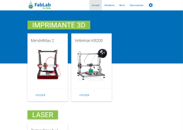
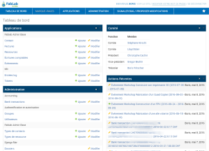
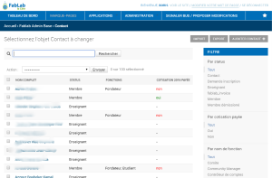
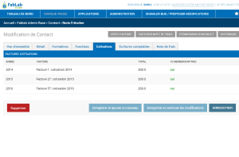
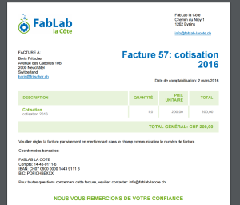
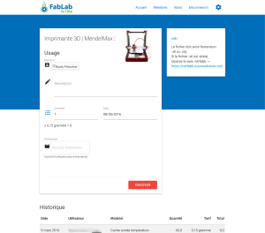
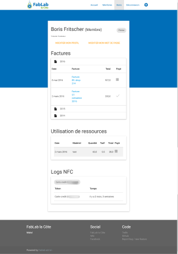

# FabLab Administration Tool

A series of domain objects, methods and CRUD views to manage different aspect of a FabLab.

For rapid prototyping and customizability django-admin is used heavily.

## Gallery

[](doc/screens/home.png)
[](doc/screens/dashboard.png)
[](doc/screens/contacts.png)
[](doc/screens/contact.png)
[](doc/screens/invoice.png)
[](doc/screens/usage.png)
[](doc/screens/profile.png)

## General Features
- Multilingual: FR, EN (possible to translate easily with po files)
- Basic frontend service portal
    - Membership registration
    - Track machine usage
    - Display member list with trainings and functions
    - User's personal page
        - invoice list
        - machine usage list
        - NFC badge logs
        - Edit contact details
- CRUD administration of following domain objects and functions:
    - Contact
        - ContactType (external, members,...)
        - Tracking of membership status and payment
        - Tracking of functions
        - Tracking of Training on resources
        - Tracking of expenses
        - Synchronize e-mails with MailChimp distribution lists
    - Resource (machines,..)
        - ResourceType (laser, ...)
        - ResourceUsage
    - Event
        - Registration to Events
        - Expense for event
    - Invoice/Expense
        - Entries (anything to invoice or expense)
            - Usage
            - Registration to events
            - Memberships
        - PDF invoice generation
        - Invoice mailing
    - NFC tokens, and logs


## Specific FabLab-la Cote
- ccv-webshop support
  - webhook endpoint to import orders from our webshop
  - and create invoices
  - and event registrations

- postfiance CAMT xml import
  - allows to consolidate invoices with money received on our postfinance account
- current theme is hardcoded

## Not Implemented

Features which are not supported, but could one day be:

- Stock management
- Resource reservation
- More accounting
- More self-service functions


## Used Environment Variables

create .env file in root

```
DEBUG=True # or empty for production
SECRET_KEY=
STATIC_ROOT=/app/static/
STATIC_URL=static/
MEDIA_ROOT=/app/media/
MEDIA_URL=media/
POSTGRES_USER=user
POSTGRES_PASSWORD=password
DATABASE_URL=postgres://user:password@db/fablabadmin
RECAPTCHA_PRIVATE_KEY = 'your private key'
RECAPTCHA_PUBLIC_KEY = 'your public key'
CCVSHOP_DOMAIN = 'full url to securearea url'
CCVSHOP_PRIVATE_KEY = 'your private key'
CCVSHOP_PUBLIC_KEY = 'your public key'
```

## docker comands
```
 docker-compose build
 docker-compose up -d

 # during dev, is done also on startup
 docker-compose run web python manage.py migrate
 docker-compose run web python manage.py createsuperuser
 docker-compose run web python manage.py collectstatic
```

## During Development
### making translations
Inside eacho app module folder
```
django-admin makemessages
```
make adjustments to translations files (check dirty flags)
```
django-admin compilemessages
```